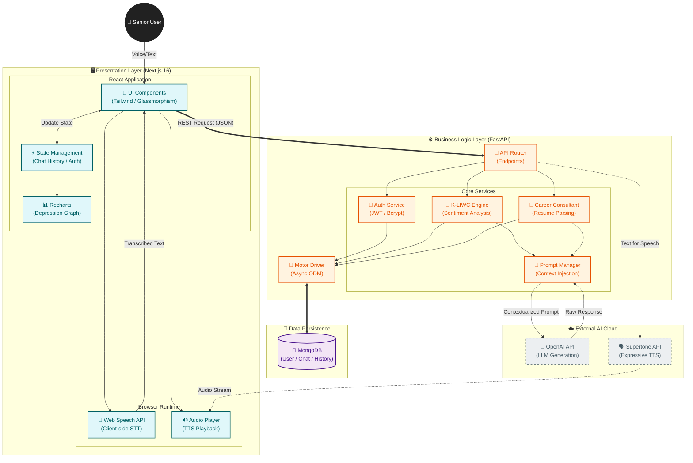

# 🌟 RetireWeb (리타이어웹)

은퇴 후 시니어를 위한 **AI 챗봇 및 커리어 컨설팅 종합 멘탈케어 플랫폼**입니다.
최신 AI 기술과 노인 친화적인 UI/UX를 결합하여, 어르신들의 정서적 안정과 제2의 인생 설계를 지원합니다.

> **현재 상태**: 
- ✅ 로그인 구현 완료 (bcrypt 호환성 문제 해결)
- ✅ 챗봇 기능 구현 완료 (K-LIWC 기반 우울 수치 분석, 가중 평균 로직 적용)
- ✅ 음성 대화 기능 완료 (Web Speech API STT, Supertone API TTS)
- ✅ AI 컨설팅 구현 완료
- ✅ 우울 수치 그래프 시각화 완료 (recharts)
- ✅ PHQ-9 우울 자가검사 설문조사 구현 완료
- ✅ 커리어 컨설팅 히스토리 조회 기능 완료
- ✅ 노인 친화적 디자인 리뉴얼 완료 (따뜻한 색상, 자연 배경, 글래스모피즘)
- ✅ 프론트엔드 Next.js 전환 완료 (반응형 UI, 노인 친화적 디자인)

---

## 📚 목차
1. [최근 업데이트](#-최근-업데이트)
2. [핵심 기능 상세](#-핵심-기능-상세)
3. [시스템 아키텍처](#-시스템-아키텍처)
4. [K-LIWC 우울 정서 분석 알고리즘](#-k-liwc-우울-정서-분석-알고리즘)
5. [API 명세서](#-api-명세서)
6. [기술 스택 및 구현 상세](#-기술-스택-및-구현-상세)
7. [설치 및 실행](#-설치-및-실행)
8. [문제 해결](#-문제-해결)

---

## 📋 최근 업데이트

### 🎨 노인 친화적 디자인 리뉴얼 (Senior-Friendly Design)
- **따뜻한 색상 팔레트**: Warm Teal(#2dd4bf), Soft Orange(#fb923c), Creamy White(#fdfbf7) 적용
- **가독성 강화**: 기본 폰트 크기 확대(20px), Noto Sans KR 폰트 적용
- **직관적인 UI**: 글래스모피즘(Glassmorphism) 카드 디자인, 큰 아이콘 및 버튼
- **자연 친화적 배경**: 눈이 편안한 자연(숲/나뭇잎) 배경 이미지 적용
- **반응형 최적화**: 모바일/태블릿/데스크톱 완벽 대응

### 💬 챗봇 및 입력창 개선
- **입력 편의성**: 'Enter' 키로 전송, 'Shift + Enter'로 줄바꿈 기능 추가
- **모바일 최적화**: 모바일 환경에서 입력창 레이아웃 및 버튼 크기 최적화
- **시야 확보**: 모바일에서 채팅 영역 높이 확장 (500px -> 650px)
- **텍스트 오버플로우 수정**: 긴 메시지 자동 줄바꿈 처리

### 📊 우울 수치 분석 고도화
- **K-LIWC 기반 분석**: 한국어 언어심리분석 사전(K-LIWC)을 활용한 정교한 우울 수치 측정
- **색상 로직 개선**: 우울 점수에 따른 직관적인 색상 변화
  - 0~3점: **파란색 (안정)**
  - 4~7점: **연두색 (주의)**
  - 8~10점: **빨간색 (위험)**
- **가중 평균 계산**: 최근 3개 대화 30%, 전체 평균 30%, 새 수치 40% 가중치 적용
- **대화 기록 개선**: 긴 텍스트 자동 줄바꿈 처리, UI 오버플로우 해결
- **상태 박스 최적화**: '현재 마음 상태' 박스 높이 축소로 공간 효율성 증대

---

## 🚀 핵심 기능 상세

### 1. 🤖 AI 심리 상담 챗봇 (Deep Dive)
단순한 응답 생성을 넘어, 사용자의 심리 상태에 맞춰 **동적으로 페르소나를 조정**합니다.

- **동적 페르소나 시스템 (Dynamic Persona System)**:
    - **안정 상태 (0-3점)**: "밝고 긍정적인 친구" 톤으로 일상적인 대화를 주도하며 활력을 북돋아줍니다.
    - **주의 상태 (4-7점)**: "공감하는 상담가" 톤으로 전환되어, 사용자의 감정을 읽어주고 위로하는 대화에 집중합니다.
    - **위험 상태 (8-10점)**: "전문적인 케어기버" 톤으로, 섣불리 조언하기보다 경청하며 전문 기관의 도움을 부드럽게 권유합니다.

- **컨텍스트 인식 (Context Awareness)**:
    - 대화 생성 시 `최근 대화 기록` + `PHQ-9 검사 결과` + `현재 우울 점수`를 프롬프트에 함께 주입합니다.
    - 예: "지난번 검사에서 수면 장애가 있다고 하셨는데, 어젯밤은 잘 주무셨나요?"와 같은 개인화된 안부 묻기가 가능합니다.

### 2. 💼 AI 커리어 컨설팅 (NLP Pipeline)
복잡한 입력 폼 대신, 어르신들이 편하게 줄글로 쓴 자기소개를 구조화된 데이터로 변환합니다.

- **자연어 처리 파이프라인**:
    1. **비정형 텍스트 입력**: "나는 30년간 초등학교 교사로 일했고, 아이들을 가르치는 게 좋았어. 컴퓨터는 잘 못해."
    2. **구조화 (Structuring)**: LLM이 텍스트에서 `경력(30년 교사)`, `직무 선호(교육)`, `역량(티칭)`, `제약사항(컴퓨터 활용 능력 낮음)`을 추출.
    3. **분석 및 매칭**: 추출된 데이터를 바탕으로 5단계 분석(강점/개선점/추천직무/방향성/액션플랜) 수행.
    4. **리포트 생성**: 시니어가 이해하기 쉬운 용어로 순화된 최종 컨설팅 리포트 제공.

### 3. 🗣️ 하이브리드 음성 인터페이스
지연 시간(Latency)과 품질(Quality)의 균형을 맞춘 하이브리드 방식을 채택했습니다.

- **입력 (STT)**: **Web Speech API** (브라우저 내장)
    - **이유**: 서버를 거치지 않고 즉각적인 텍스트 변환이 가능하여, 말하는 도중 끊김 없는 경험 제공. 별도 비용 발생 없음.
- **출력 (TTS)**: **Supertone API**
    - **이유**: 기계적인 음성이 아닌, 감정이 실린 고품질의 한국어 음성을 생성하여 정서적 유대감 형성.

---

## 🏗 시스템 아키텍처

본 프로젝트는 **MSA(Microservices Architecture)** 지향의 모던 웹 아키텍처를 따릅니다.



---

## 🧠 K-LIWC 우울 정서 분석 알고리즘

RetireWeb의 핵심 경쟁력은 **K-LIWC (Korean Linguistic Inquiry and Word Count)** 방법론을 적용한 독자적인 우울 수치 분석 알고리즘입니다.

### 1. 분석 지표 (11 Markers)
사용자의 대화 텍스트에서 다음 요소들의 빈도와 강도를 분석하여 0~10점 척도로 변환합니다:

1.  **1인칭 단수 대명사 증가**: `나`, `내`, `내가` 등의 과도한 자기 몰입 표현 (Self-focus)
2.  **부정 정서 단어 증가**: 슬픔, 불안, 분노 관련 어휘의 빈도
3.  **정서 강도**: 감정 표현의 격렬함 정도 (예: "조금 슬퍼" vs "죽고 싶을 만큼 비참해")
4.  **사회적 단어 감소**: 가족, 친구, 동료 등 타인 지칭 단어의 부재 (사회적 고립 시사)
5.  **긍정 정서 단어 감소**: 기쁨, 감사, 희망 관련 어휘의 현저한 저하
6.  **인지 왜곡 및 극단적 표현**: `항상`, `전혀`, `모두`, `절대` 등 흑백 논리적 어휘
7.  **인지 처리 단어 증가**: `아마`, `~인 것 같다` 등 불확실성과 반추(곱씹음)를 나타내는 표현
8.  **부정적 자기 평가**: 자책, 비하, 무가치감 표현
9.  **신체적 증상 호소**: 피로, 수면 장애, 무기력, 식욕 부진 언급
10. **미래 지향 단어 감소**: 계획, 기대, 내일 등 미래 관련 어휘 부재 (절망감)
11. **행동 관련 단어 감소**: 구체적인 활동이나 움직임을 나타내는 동사 감소

### 2. 점수 산출 및 보정 (Scoring & Smoothing)
분석된 결과는 0~10점 척도로 변환되며, 일시적인 감정 기복으로 인한 오탐지를 방지하기 위해 **가중 이동 평균(Weighted Moving Average)** 방식을 사용합니다.

$$ Score_{final} = (S_{current} \times 0.4) + (S_{recent\_avg} \times 0.3) + (S_{total\_avg} \times 0.3) $$

- **현재 대화 (40%)**: 지금 나누고 있는 대화의 감정 상태를 가장 중요하게 반영
- **최근 3회 평균 (30%)**: 단기적인 감정 추세 반영 (급격한 변화 완화)
- **전체 누적 평균 (30%)**: 장기적인 기분 상태 (기저선) 반영

---

## 🔌 API 명세서

### 인증 (Authentication)
| Method | Endpoint | 설명 |
|--------|----------|------|
| `POST` | `/api/signup` | 신규 회원가입 |
| `POST` | `/api/login` | 로그인 및 JWT 토큰 발급 |
| `GET` | `/api/user` | 현재 로그인한 사용자 정보 조회 |

### 챗봇 (Chatbot)
| Method | Endpoint | 설명 |
|--------|----------|------|
| `POST` | `/api/chat` | 챗봇과 대화 (우울 수치 분석 포함) |
| `GET` | `/api/chat/history` | 사용자의 전체 대화 기록 및 우울 수치 조회 |
| `GET` | `/api/depression/status` | 현재 우울 상태 및 통계 조회 |

### 커리어 컨설팅 (Career)
| Method | Endpoint | 설명 |
|--------|----------|------|
| `POST` | `/api/career/consultation/natural` | 자연어 이력서 기반 커리어 컨설팅 생성 |
| `GET` | `/api/career/history` | 과거 컨설팅 기록 조회 |

### 기타 (Others)
| Method | Endpoint | 설명 |
|--------|----------|------|
| `POST` | `/api/phq9` | PHQ-9 설문 결과 제출 |
| `POST` | `/api/audio/synthesize` | 텍스트를 음성으로 변환 (Supertone API) |

---

## 🛠 기술 스택 및 구현 상세

### Frontend
- **Next.js 16.0.1 (App Router)**:
    - 최신 React 기능을 활용하기 위해 채택.
    - SEO 최적화와 초기 로딩 속도 개선을 위해 서버 사이드 렌더링(SSR) 적극 활용.
- **Tailwind CSS v3 (Custom Design System)**:
    - **Color Palette**: 시각적 편안함을 위해 `warm-teal`(#2dd4bf), `soft-orange`(#fb923c) 등 커스텀 컬러 정의.
    - **Animations**: `blob` (배경 유동 효과), `fade-in-up` (부드러운 등장) 등 마이크로 인터랙션 구현.
- **Accessibility (접근성)**:
    - `Noto Sans KR` 폰트 적용 및 기본 폰트 사이즈 상향(20px)으로 노안이 있는 사용자 배려.

### Backend
- **FastAPI (Python)**:
    - **Async/Await**: AI 모델 호출, DB 쿼리 등 I/O 바운드 작업이 많은 서비스 특성상, 비동기 처리를 통해 동시 접속자 처리 성능 극대화.
- **Motor (Async MongoDB Driver)**:
    - `pymongo` 대신 `motor`를 사용하여 FastAPI의 비동기 성능을 저해하지 않고 DB 작업 수행.
- **Security**:
    - `bcrypt`를 직접 사용하여 비밀번호 해싱 (라이브러리 호환성 이슈 해결).
    - JWT 기반의 Stateless 인증으로 확장성 확보.

---

## 🚀 설치 및 실행

### 1. 저장소 클론
```bash
git clone https://github.com/Hanshin-OSS-Hub/capstone25-retire-web.git
cd capstone25-retire-web
```

### 2. 백엔드 설정

#### 가상환경 생성 및 활성화
```bash
# Windows
python -m venv venv
venv\Scripts\activate

# macOS/Linux
python3 -m venv venv
source venv/bin/activate
```

#### 의존성 설치
```bash
pip install -r requirements.txt
```

#### 환경 변수 설정
프로젝트 루트에 `.env` 파일을 생성하고 다음 내용을 추가하세요:

```env
# MongoDB 설정
MONGODB_URI=mongodb://localhost:27017
DATABASE_NAME=mentalcare_app

# JWT 설정
SECRET_KEY=your-secret-key-change-this-in-production

# OpenAI API 설정
OPENAI_API_KEY=your-openai-api-key-here

# Supertone API 설정
SUPERTONE_API_KEY=your_supertone_api_key_here
SUPERTONE_VOICE_ID=195e1922033a6168f0c90f
```

**⚠️ 보안 주의사항**: 
- `.env` 파일은 절대 Git에 커밋하지 마세요
- 실제 API 키는 `.env` 파일에만 저장하세요

#### MongoDB 실행
```bash
# Windows
net start MongoDB

# macOS (Homebrew)
brew services start mongodb-community

# Linux
sudo systemctl start mongod
```

**⚠️ 중요**: MongoDB가 실행되지 않으면 로그인이 작동하지 않습니다!

#### 백엔드 서버 실행
```bash
python main.py
```

백엔드는 [http://localhost:8000](http://localhost:8000)에서 실행됩니다.

### 3. 프론트엔드 설정

#### 프론트엔드 디렉토리로 이동
```bash
cd frontend
```

#### 의존성 설치
```bash
npm install
```

#### 환경 변수 설정
`frontend/.env.local` 파일을 생성하고 다음 내용을 추가하세요:

```env
NEXT_PUBLIC_API_URL=http://localhost:8000
# ngrok 사용 시 (매 세션마다 URL이 변경되면 업데이트 필요)
NEXT_PUBLIC_NGROK_URL=https://your-ngrok-url.ngrok-free.app
```

**ngrok 사용 시 (무료 플랜 - 한 세션만 사용 가능):**

무료 ngrok은 한 번에 하나의 터널만 사용할 수 있으므로, **프론트엔드만 ngrok으로 노출**하고 백엔드는 로컬 IP로 접근해야 합니다.

1. **PC의 로컬 IP 확인**:
   ```bash
   # Windows
   ipconfig
   # IPv4 주소 확인
   ```

2. **프론트엔드 ngrok 시작**:
   ```bash
   ngrok http 3000
   ```

3. **환경 변수 설정** (`frontend/.env.local`):
   ```env
   # 백엔드는 PC의 로컬 IP로 접근 (같은 네트워크에서만 가능)
   NEXT_PUBLIC_API_URL=http://<your-local-ip>:8000
   # 프론트엔드 ngrok URL (매 세션마다 변경되면 업데이트)
   NEXT_PUBLIC_NGROK_URL=https://your-frontend-ngrok-url.ngrok-free.app
   ```

4. **프론트엔드 서버 재시작**:
   ```bash
   cd frontend
   npm run dev
   ```

**중요**: 
- `NEXT_PUBLIC_API_URL`은 **반드시 PC의 로컬 IP**로 설정해야 합니다 (localhost 불가)

- ngrok URL이 변경되면 `NEXT_PUBLIC_NGROK_URL`만 업데이트하면 됩니다

#### 프론트엔드 개발 서버 실행
```bash
npm run dev
```

프론트엔드는 [http://localhost:3000](http://localhost:3000)에서 실행됩니다.

### 4. 다른 기기/네트워크에서 접속하기

1. **환경 변수 설정**
   - 백엔드 `.env` 파일에서 `ALLOWED_ORIGINS`를 실제 프론트엔드 주소로 설정합니다.
     ```env
     ALLOWED_ORIGINS=https://app.example.com,https://admin.example.com
     ```
   - 프론트엔드 `frontend/.env.local`에서 `NEXT_PUBLIC_API_URL`을 외부에서 접근 가능한 백엔드 URL로 설정합니다.
     ```env
     NEXT_PUBLIC_API_URL=https://api.example.com
     ```

2. **서버 바인딩**
   - FastAPI는 `uvicorn.run(..., host="0.0.0.0")`로 실행되므로 외부 접속이 가능합니다.
   - 방화벽/보안 그룹에서 8000(백엔드), 3000(프론트) 포트를 허용해야 합니다.

3. **로컬 네트워크 접속**
   - 모바일 등 같은 네트워크의 다른 기기에서 접속하려면 PC의 로컬 IP를 사용합니다.
     - 백엔드: `http://<PC_IP>:8000`
     - 프론트엔드: `http://<PC_IP>:3000`
   - FastAPI CORS 설정은 192/10/172 대역 IP와 ngrok 도메인을 자동으로 허용합니다.

4. **공인 도메인/HTTPS**
   - 배포 환경에서는 프록시(예: Nginx)에서 SSL을 종료하고, 백엔드로 프록시합니다.
   - 프론트엔드와 백엔드 모두 동일한 도메인(또는 `ALLOWED_ORIGINS`/`NEXT_PUBLIC_API_URL`로 명시된 도메인)을 사용해야 합니다.

## 🔧 문제 해결

### 로그인이 안 될 때
1. **MongoDB 상태 확인**:
   ```bash
   netstat -ano | findstr :27017
   ```

2. **MongoDB 재시작**:
   ```bash
   net stop MongoDB
   net start MongoDB
   ```

3. **서버 재시작**:
   ```bash
   # Ctrl+C로 서버 중지 후
   python main.py
   ```

### 프론트엔드가 실행되지 않을 때
1. **의존성 재설치**:
   ```bash
   cd frontend
   rm -rf node_modules package-lock.json
   npm install
   ```

2. **포트 확인**:
   - 백엔드: 8000번 포트
   - 프론트엔드: 3000번 포트

### OpenAI API 오류
- API 키가 올바른지 확인
- 인터넷 연결 상태 확인
- API 사용량 한도 확인

### 음성 인식이 작동하지 않을 때
- Chrome, Edge 등 최신 브라우저 사용
- 마이크 권한 확인
- HTTPS 또는 localhost에서만 작동
